# AI 算法岗校招知识思维导图

> 与[面试题速查](./README.md)配套使用。每张图按“大类 → 核心知识点 → 子知识点”展开，用于开始复习前建立全局框架，以及面试前快速查漏补缺。

## 目录

1. [数学、概率与统计](#1-数学概率与统计)
2. [机器学习](#2-机器学习)
3. [深度学习](#3-深度学习)
4. [CV、NLP 与推荐系统](#4-cvnlp-与推荐系统)
5. [强化学习](#5-强化学习)
6. [Transformer 与 LLM](#6-transformer-与-llm)
7. [大模型微调与对齐](#7-大模型微调与对齐)
8. [RAG](#8-rag)
9. [Agent](#9-agent)
10. [训练、推理与 MLOps](#10-训练推理与-mlops)
11. [Python、SQL 与计算机基础](#11-pythonsql-与计算机基础)
12. [手撕代码与数学推导](#12-手撕代码与数学推导)
13. [项目追问、系统设计与行为面](#13-项目追问系统设计与行为面)

## 1. 数学、概率与统计

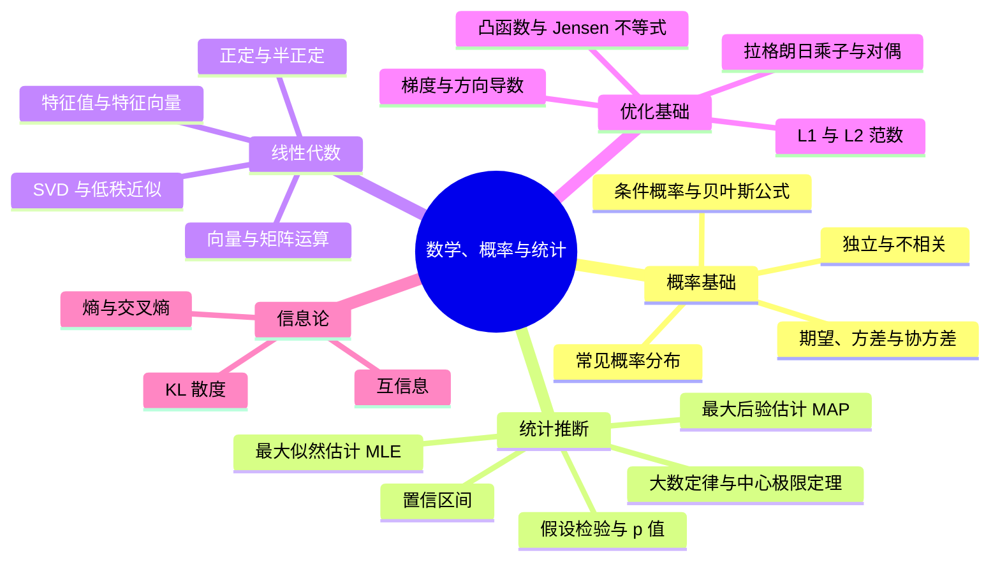

## 2. 机器学习

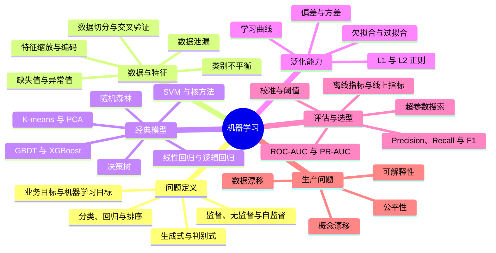

## 3. 深度学习

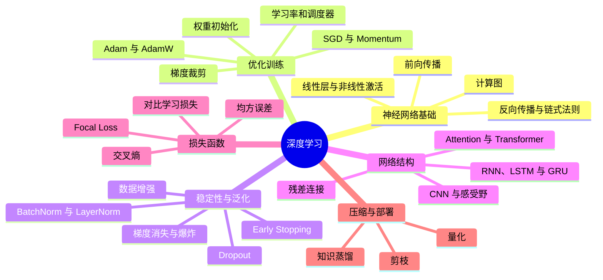

## 4. CV、NLP 与推荐系统

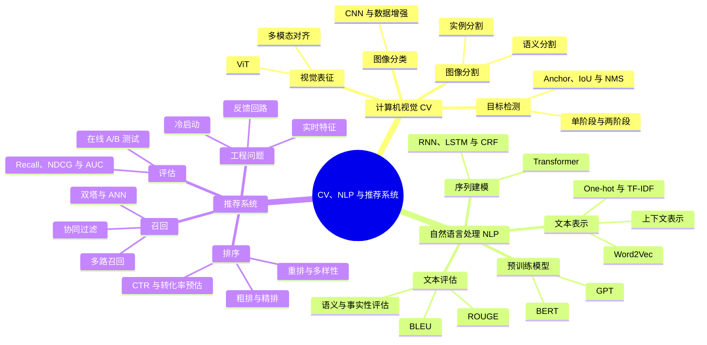

## 5. 强化学习

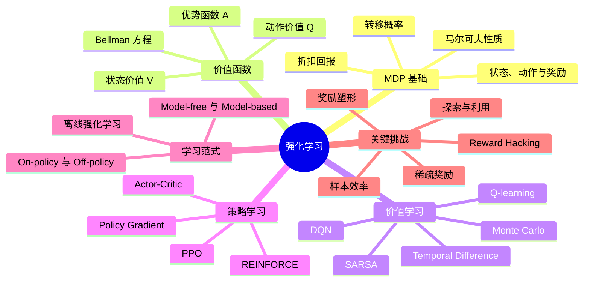

## 6. Transformer 与 LLM

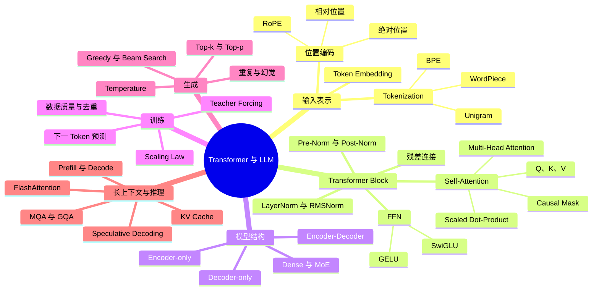

## 7. 大模型微调与对齐

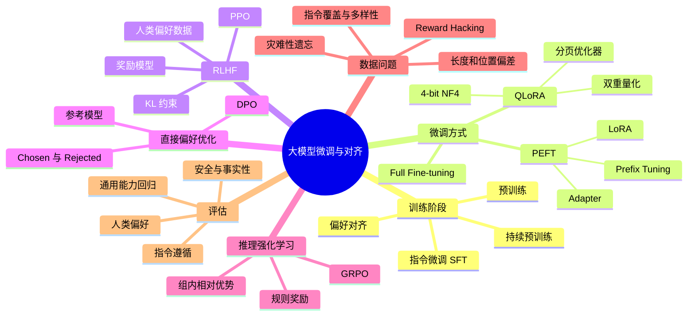

## 8. RAG

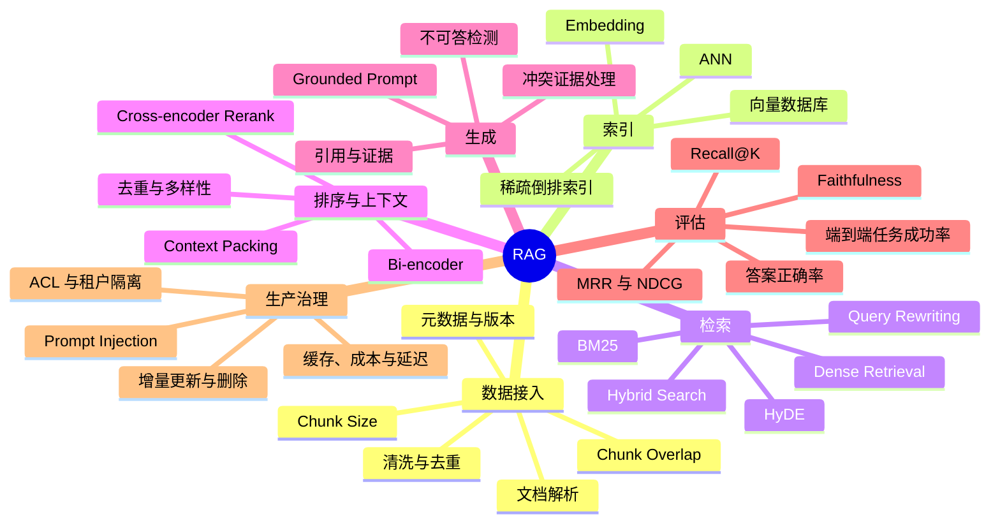

## 9. Agent

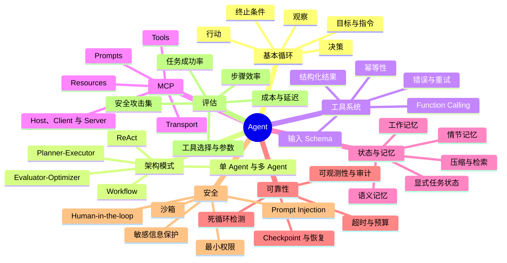

## 10. 训练、推理与 MLOps

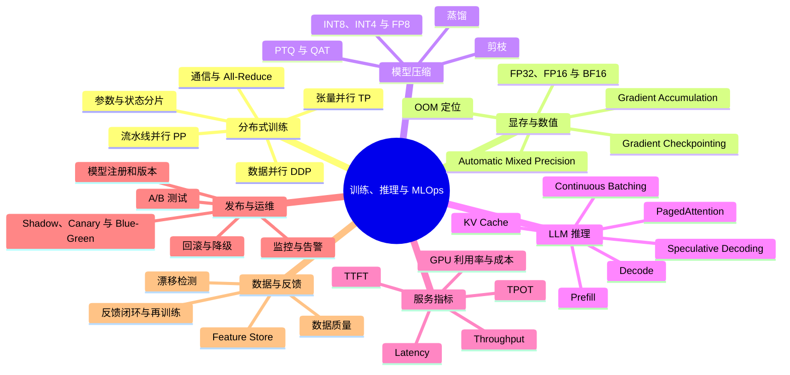

## 11. Python、SQL 与计算机基础

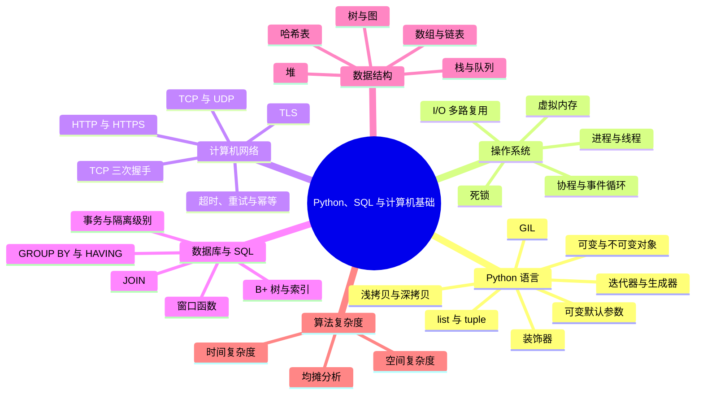

## 12. 手撕代码与数学推导

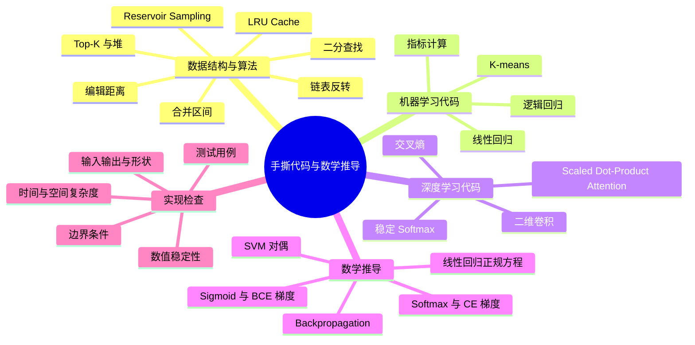

## 13. 项目追问、系统设计与行为面

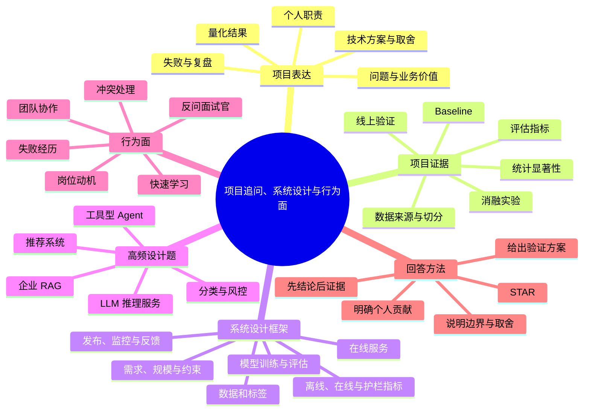
