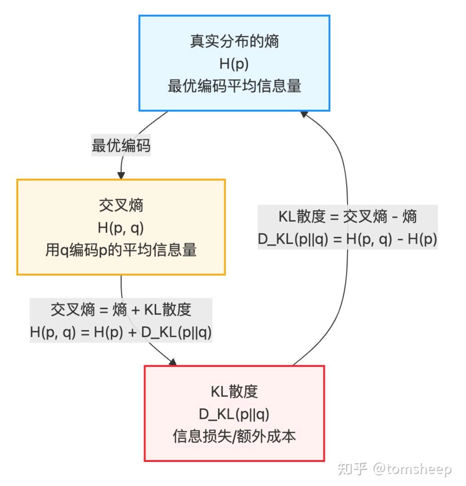

在监督学习中我们会有一个标准答案：label y和预测值prediction，为了让预测值不断接近真实答案，就需要用到损失函数了。

<!-- more -->

## 信息论基础

在正式讲解损失函数前，先需要普及一点点信息论的概念，因为熵（Entropy）对于理解交叉熵，KL散度等概念很重要。

我们首先考虑如何量化一个特定事件所包含的信息量。直观上，一个事件发生的概率越低，它的发生就越出乎意料，因此它所携带的信息量就越大。反之，一个事件发生的概率越高，它的发生就越司空见惯，信息量就越小。

- 对一个**随机变量X的的单个事件x取值**的自信息 = $I(x) = -logP(X=x)$

概率越小，自信息越大，概率越大，自信息越小

- 而整个随机变量的**所有事件的平均信息量**就是熵，表示一个随机变量中事件信息量的期望。

$$
H(X) = E[I(X)] = -\sum^{N}_{i = 1}p(x_i) * log p(x_i)
$$

熵 = 一个事件的概率 * 事件的自信息  的和。 


举个例子，假如随机变量X的空间只有三种结果：2，3，3。也就是说P（X=2）= 1/3， P（X=3） = 2/3 
那么单个事件X=3的自信息量 = $-log\frac{2}{3}$

整个X=x的熵 = $-(\frac{1}{3} * log\frac{1}{3} + \frac{2}{3} * log\frac{2}{3})$


ok回到公式，其他的熵的公式为：
- 联合熵 Joint Entropy

$$
H(X,Y) = -\sum_{x}\sum_{y}p(x, y) * log p(x, y)
$$


- 条件熵 Conditional Entropy

$$
H(Y | X) = -\sum_{x}\sum_{y}p(x, y) * log P(y | x)
$$


### 交叉熵：衡量预测与真实分布的「不一致性」

我们通常用p(x)表示真实的目标分布，用q(x)表示模型预测的近似分布，它们之间的**交叉熵（Cross-Entropy）** 定义为：

$$
H(p, q) = -\sum^{N}_{i = 1}p(x) * \log q(x)
$$

**最小化交叉熵，就等价于最大化真实标签对应的预测概率的对数**。

### KL散度

**KL散度（Kullback-Leibler Divergence），也称为相对熵(Relative Entropy)** 是衡量两个概率分布p(x)和q(x)之间(用q拟合 p 分布)差异的非对称度量。它的定义为：


$$
KL(p || q) = -\sum p(x) * log\frac{p(x)}{q(x)}
$$

KL散度的性质：

- **非负性：**。KL散度 ≥ 0 这意味着当两个分布完全相同时，没有信息损失。
- **非对称性：**。这是一个关键性质。这意味着KL散度不是一个真正的「距离」（因为它不满足距离度量的对称性），它衡量的是从p到 q的「信息损失」或「额外成本」，而不是反过来。

也就是说，熵与KL的关系图如下




直接从公式推导的话，可以得出交叉熵 = 熵 + KL散度，展开：
$$
\begin{aligned}
D_{KL}(P \parallel Q) 
&= \sum_x P(x) \log \frac{P(x)}{Q(x)} \\
&= \sum_x P(x) \bigl[ \log P(x) - \log Q(x) \bigr] \\
&= \underbrace{\sum_x P(x) \log P(x)}_{-H(P)} - \sum_x P(x) \log Q(x) \\
&= -H(P) + H(P, Q)
\end{aligned}
$$

最后一步将等式重新排列，就得到：

$$
\boxed{H(P, Q) = H(P) + D_{KL}(P \parallel Q)}
$$

## 损失函数（loss function）：先定义什么叫错

模型训练把“预测错了多少”变成一个可以计算的数值。这个数值就是 loss。不同任务会使用不同 loss。

### MSE：回归任务里最常见的 loss

Mean Squared Error 常用于回归任务：

$$
J(\theta) = \frac{1}{n}\sum_{i=1}^{n}(y_i - \hat{y}_i)^2
$$

其中，$y_i$ 是真实值，$\hat{y}_i$ 是预测值。预测和真实值差得越远，loss 越大。

它惩罚预测值和真实值之间的平方误差。因为误差被平方，大误差会受到更大惩罚。

例子：

| 真实值 $y$ | 预测值 $\hat{y}$ | 误差 | 平方误差 |
|---:|---:|---:|---:|
| 100 | 90 | 10 | 100 |
| 100 | 50 | 50 | 2500 |

第二个预测只比第一个多错 40，但平方误差大很多。这就是 MSE 对大偏差更敏感的原因。

所以 MSE 的直觉是：不仅希望预测接近真实值，而且特别不希望出现很离谱的预测。

### 二元交叉熵（binary cross entropy）：二分类任务

二分类中，模型通常输出样本属于正类的概率 $\hat{y}$：

$$
L(y, \hat{y}) = -[y\log(\hat{y}) + (1-y)\log(1-\hat{y})]
$$

如果真实标签 $y=1$，这个式子会变成 $-\log(\hat{y})$。模型给正确类别的概率越低，loss 越大。

比如一封邮件确实是垃圾邮件。如果模型预测“是垃圾邮件”的概率是 0.9，loss 很小；如果只给 0.1，loss 会很大。Cross entropy 惩罚的不是类别名本身，而是模型有没有把足够高的概率给到正确类别。

这和分类任务的目标一致：模型不只是要给出类别，还要把概率质量放到正确类别上。

### 多类交叉熵（categorical cross entropy）：多分类任务

多分类任务常用 softmax 把 logits 转成概率分布：

$$
\text{softmax}(z_i) = \frac{e^{z_i}}{\sum_{j=1}^{K}e^{z_j}}
$$

根据信息论推导出来的公式应该是：
$$
H(p, q) = -\sum_{x} p(x) \log q(x)
$$
代表用q (prediction)去拟合p (label)的分布。

用在实际情况中用y和y hat表示：

$$
L(y, \hat{y}) = -\sum_{j=1}^{K} y_j \log(\hat{y}_j)
$$

如果 $y$ 是 one-hot label，这个式子本质上就是取正确类别概率的负对数。

实现时一般会对 logits 做数值稳定处理，例如先减去最大值：

```python
def softmax(logits):
    logits = logits - np.max(logits, axis=1, keepdims=True)
    exp_logits = np.exp(logits)
    return exp_logits / np.sum(exp_logits, axis=1, keepdims=True)

def mean_squared_error(y_true, y_pred):
    return np.mean((y_true - y_pred)**2)

def binary_cross_entropy(y_true, y_pred):
    return -np.mean(y_true * np.log(y_pred) + (1 - y_true) * np.log(1 - y_pred))

def cross_entropy(y_pred, y_true):
    eps = 1e-12
    y_pred = np.clip(y_pred, eps, 1.0 - eps)
    return -np.mean(np.sum(y_true * np.log(y_pred), axis=1))
```

思考：
1. 为什么是y true * log（y pred）而不能反着来呢？
因为是用q分布（pred）去拟合真实分布，而q必须在log里

2. 为什么交叉熵前面有负号？
两个容易写错的点：第一，cross entropy 前面有负号；第二，如果输入是 logits，应该先 softmax，而不是直接拿 logits 当概率。

## 梯度下降（gradient descent）：模型如何优化参数

有了 loss 后，训练的目标就是找到让 loss 更小的参数。

Gradient descent 的更新规则是：

$$
\theta_{\text{new}} = \theta_{\text{old}} - \alpha \nabla J(\theta)
$$

其中，$\theta$ 是模型参数，$\alpha$ 是 learning rate，$\nabla J(\theta)$ 是 loss function对参数的梯度。

直觉上，梯度指向 loss 增长最快的方向，所以参数更新要往反方向走。

训练时可以把流程想成：


current parameters
1. forward prediction
2. compute loss
3. compute gradient
4. update parameters
5. repeat

下面用一维 linear regression 展示一次完整训练循环。

```python
import numpy as np

x = np.array([1.0, 2.0, 3.0, 4.0])
y = np.array([3.0, 5.0, 7.0, 9.0])  # y = 2x + 1

w, b = 0.0, 0.0
learning_rate = 0.05

for step in range(500):
    # forward
    y_pred = w * x + b
    error = y_pred - y
    loss = np.mean(error ** 2)

    # backward: MSE 对 w 和 b 的梯度
    grad_w = 2 * np.mean(error * x)
    grad_b = 2 * np.mean(error)

    # update
    w -= learning_rate * grad_w
    b -= learning_rate * grad_b
```

随着训练进行，`w` 会逐渐接近 2，`b` 会逐渐接近 1。神经网络的训练循环也是这四步，只是 forward 和 gradient 的计算图更复杂。


## 正则化（regularization）：限制模型复杂度

Regularization的主要作用是限制模型为了降低训练误差而使用过于复杂的参数，增加模型的泛化能力。

常见方式是在原本 loss 后面加一个惩罚项：

$$
J_{\text{regularized}}(\theta) = J(\theta) + \lambda R(\theta)
$$

其中，$R(\theta)$ 是 regularization term，$\lambda$ 控制正则化强度。

### L1 正则化（L1 regularization）

L1 正则使用参数绝对值之和：

$$
R(\theta) = \sum_i |\theta_i|
$$

它的特点是容易让部分参数变成0（可以变成0），因此可以产生稀疏性，也常被用于特征选择。

直觉上，如果一个特征贡献不大，L1 会倾向于直接把它的权重压到 0。

### L2 正则化（L2 regularization）

L2 正则使用参数平方和：

$$
R(\theta) = \sum_i \theta_i^2
$$

它会让参数变小，但通常不会直接变成 0。L2 更像是在鼓励模型使用更平滑、更小的权重。

很多时候提到的 weight decay 和 L2 regularization 相关，都是通过限制权重大小来降低模型复杂度。

| 方法 | 作用 | 结果 |
|---|---|---|
| L1 | 惩罚绝对值 | 参数更稀疏，部分权重为 0 |
| L2 | 惩罚平方和 | 参数更小更平滑，通常不为 0 |

L1 更像在做“删特征”，L2 更像在做“压权重”。

## 其他防止过拟合的方法：

**早停（early stopping）：用验证集控制训练**

Early stopping 是一种很实用的防过拟合方法。

训练过程中，如果 validation loss 连续若干轮（比如设置个3，5轮）不再下降，就停止训练。关键是看 validation set，而不是只看 training loss。

它的直觉是：当模型继续训练只是在降低 training loss，但 validation loss 开始变差时，模型可能已经开始记训练集噪声了。

Early stopping 的优点是简单有效，缺点是它会把“什么时候停止训练”也变成一个需要调的超参数。

**dropout**：
在训练过程中，每次前向传播时以一定概率随机“丢弃”一部分神经元（即将输出置零），反向传播不更新被丢弃神经元的权重。
测试时不丢弃，但将所有权重乘以保留概率以保证尺度一致。

直觉上，dropout 强迫网络不能过度依赖某些特定的神经元或特征组合，相当于每次训练一个不同的子网络，最终预测时近似于大量子网络的集成，从而显著降低过拟合风险。


```python

# 使用时，定义 dropout 层（p=0.5），训练时随机丢弃，eval时自动关闭
self.dropout = nn.Dropout(0.5)
x = self.dropout(x)

#dropout的实现
def dropout_forward(x, p=0.5, training=True):
    if not training:
        return x
    # 生成与 x 形状相同的 mask，每个元素以概率 (1-p) 保留为1，以概率 p 置为0
    mask = torch.bernoulli(torch.full_like(x, 1 - p))
    # 训练时丢弃部分神经元，并将保留的神经元除以 (1-p) 保持期望一致
    return x * mask / (1 - p)
```

**data augmentation**：
简单的说就是加数据，加数据，加数据！

在不改变样本标签的前提下，对训练数据进行随机但语义合理的变换，以低成本成倍扩充有效数据量。例如，在图像任务中常用随机裁剪、水平翻转、旋转、缩放、色彩抖动等；
在文本任务中可用同义词替换、回译等。直觉是，模型看到更多变体后，能学到更本质的不变性特征，而不是死记硬背原始训练样本的表观细节，从而提升泛化能力。

优点是无需额外标注、防过拟合效果显著、提升模型鲁棒性；缺点是依赖领域知识设计合理增强策略，若变换过强或不符合真实分布，可能引入噪声误导模型。


## 参考资料

- [Stanford CS229: Machine Learning](https://cs229.stanford.edu/)
- [An Introduction to Statistical Learning](https://www.statlearning.com/)
